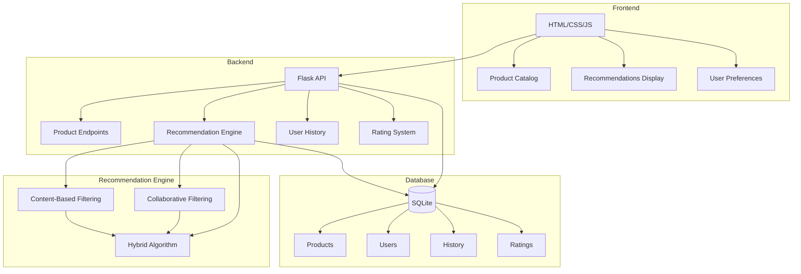

# 🛍️ Product Recommendation Agent

# By Sharan G S

An intelligent retail recommendation system that suggests products based on user preferences and browsing history using advanced machine learning algorithms.


## ✨ Features

### 🎯 Smart Recommendations
- **Hybrid Recommendation Engine**: Combines collaborative filtering and content-based filtering
- **Personalized Suggestions**: Adapts to individual user preferences and behavior
- **Real-time Updates**: Recommendations update based on user interactions

### 🛒 Product Catalog
- **Comprehensive Database**: 20+ sample products across multiple categories
- **Advanced Search**: Search by name, brand, description, or category
- **Smart Filtering**: Filter by category, price range, and ratings
- **Multiple Sort Options**: Sort by name, price, or rating

### 👤 User Tracking
- **Browsing History**: Tracks product views and interactions
- **Preference Learning**: Learns from user behavior over time
- **Rating System**: Users can rate products to improve recommendations

### 🎨 Modern UI/UX
- **Dark Mode Design**: Stunning dark theme with vibrant accents
- **Glassmorphism Effects**: Modern frosted glass aesthetic
- **Smooth Animations**: Engaging micro-interactions
- **Responsive Layout**: Works seamlessly on all devices

## 🏗️ Architecture



## 🚀 Quick Start

### Prerequisites
- Python 3.8 or higher
- pip (Python package manager)
- Modern web browser

### Installation

1. **Clone or navigate to the project directory**:
```bash
cd /Users/sharan/Downloads/Product-Recommendation-Agent
```

2. **Install dependencies**:
```bash
pip install -r requirements.txt
```

3. **Run the application**:
```bash
python app.py
```

4. **Open your browser**:
Navigate to [http://localhost:5000](http://localhost:5000)

That's it! The application will automatically initialize the database with sample data on first run.

## 📊 How It Works

### Recommendation Algorithm

The system uses a **hybrid recommendation approach** that combines three strategies:

#### 1. Collaborative Filtering (40% weight)
- Finds users with similar rating patterns using Pearson correlation
- Recommends products that similar users have rated highly
- Effective for discovering new products based on community preferences

#### 2. Content-Based Filtering (40% weight)
- Analyzes product features, categories, and brands
- Matches products to user's browsing history and preferences
- Ensures recommendations align with user's demonstrated interests

#### 3. Popularity-Based (20% weight)
- Incorporates overall product ratings and popularity
- Helps new users get started with quality recommendations
- Balances personalization with proven popular items

### User Tracking

The system tracks:
- **Product Views**: When users view product details
- **Add to Cart**: When users add products to cart
- **Ratings**: User ratings from 1-5 stars
- **Preferences**: Explicitly set category and brand preferences

All interactions are used to continuously improve recommendation quality.

## 🎮 Usage Guide

### For Users

1. **Select Your Profile**: Choose a user from the dropdown in the header
2. **Browse Products**: Explore the product catalog with search and filters
3. **View Details**: Click any product card to see full details
4. **Rate Products**: Rate products you like to improve recommendations
5. **Get Recommendations**: See personalized suggestions at the top of the page

### Sample Users

The system comes with three pre-configured users:

- **Demo User**: Interested in Electronics and Sports & Outdoors
- **Tech Enthusiast**: Focused on Electronics (Apple, Sony, Dell)
- **Fashion Lover**: Interested in Fashion (Nike, Levi's)

## 📁 Project Structure

```
Product-Recommendation-Agent/
├── app.py                      # Flask application and API endpoints
├── models.py                   # Database models (SQLAlchemy)
├── recommendation_engine.py    # Recommendation algorithms
├── data_loader.py             # Sample data initialization
├── requirements.txt           # Python dependencies
├── index.html                 # Frontend HTML structure
├── styles.css                 # Modern CSS styling
├── script.js                  # Frontend JavaScript logic
└── recommendations.db         # SQLite database (auto-generated)
```

## 🔌 API Endpoints

### Products
- `GET /api/products` - Get all products with optional filters
- `GET /api/products/<id>` - Get specific product details
- `GET /api/categories` - Get all product categories

### Recommendations
- `GET /api/recommendations/<user_id>` - Get personalized recommendations

### Users
- `GET /api/users` - Get all users
- `GET /api/users/<user_id>` - Get specific user
- `GET/POST /api/users/<user_id>/preferences` - Get/update user preferences

### History & Ratings
- `GET/POST /api/history/<user_id>` - Get/add browsing history
- `POST /api/ratings` - Submit product rating
- `GET /api/ratings/<product_id>` - Get product ratings

### Statistics
- `GET /api/stats` - Get overall system statistics

## 🎨 Customization

### Adding Products

Edit `data_loader.py` and add products to the `SAMPLE_PRODUCTS` list:

```python
{
    "name": "Product Name",
    "category": "Category",
    "subcategory": "Subcategory",
    "price": 99.99,
    "description": "Product description",
    "features": ["Feature 1", "Feature 2"],
    "brand": "Brand Name",
    "image_url": "https://example.com/image.jpg",
    "rating": 4.5,
    "num_ratings": 100
}
```

### Adjusting Recommendation Weights

Edit `recommendation_engine.py` in the `get_recommendations` method:

```python
# Current weights: 40% collaborative, 40% content, 20% popular
merged_scores[product_id] += score * 0.4  # Adjust these values
```

### Styling

Modify CSS variables in `styles.css`:

```css
:root {
    --primary-color: #6366f1;  /* Change primary color */
    --bg-primary: #0f172a;     /* Change background */
    /* ... other variables ... */
}
```

## 🔧 Technical Details

### Technologies Used

**Backend**:
- Flask 3.0.0 - Web framework
- SQLAlchemy - ORM for database operations
- NumPy - Numerical computations
- scikit-learn - Machine learning utilities

**Frontend**:
- Vanilla JavaScript - No framework dependencies
- Modern CSS3 - Glassmorphism, animations, grid layouts
- Google Fonts (Inter) - Premium typography

**Database**:
- SQLite - Lightweight, serverless database

### Performance Considerations

- Recommendation calculations are optimized for datasets up to 10,000 products
- User similarity calculations limited to top 10 similar users
- Database queries use proper indexing
- Frontend uses efficient DOM manipulation

## 🤝 Contributing

Contributions are welcome! Some ideas for enhancements:

- Add user authentication and sessions
- Implement shopping cart persistence
- Add product image upload functionality
- Create admin dashboard for product management
- Implement A/B testing for recommendation algorithms
- Add email notifications for recommendations

This is an educational project. Feel free to:
- Report issues
- Suggest improvements
- Add more features
- Improve algorithms

**Contact**: sharangs08@gmail.com
## 📄 License

This project is licensed under the MIT License - feel free to use it for learning or commercial purposes.

## 📞 Support

For questions or issues:
1. Check the API endpoints are running correctly
2. Verify database was initialized with sample data
3. Check browser console for JavaScript errors
4. Ensure all dependencies are installed

---

# Made with 💚 from Sharan G S

**
